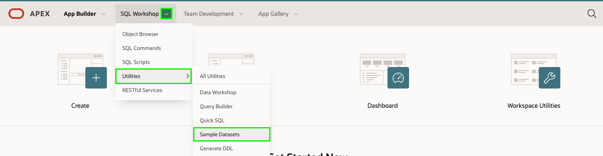
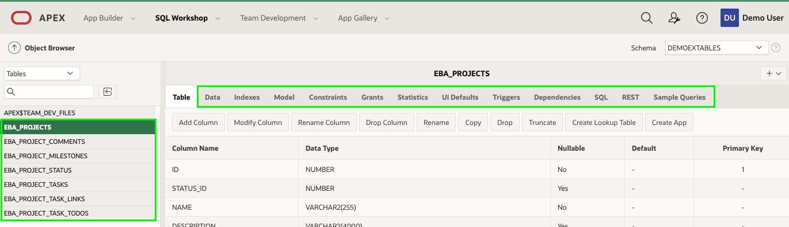

# 모듈 2 : 테이블 및 뷰 생성 - 샘플테이블 설치

이 모듈에서는 제공되는 샘플 데이터의 데이터셋에서 샘플 테이블과 뷰를 설치하는 방법에 대해서 배우게 됩니다.

## **Part 1** - 프로젝트 테이블 생성

1. 여러분의 APEX workspace 홈페이지에서 **SQL Workshop** 메뉴에 있는 **Utilities** 메뉴로 간 다음 **Sample Datasets** 메뉴를 클릭합니다.

   

2. **Project Data** 행에 있는 **``Install``** 버튼을 클릭하세요.

   

3. **``Next``** 버튼을 클릭하세요.

4. **``Install Dataset``** 버튼을 클릭하세요.

5. **``Exit``** 버튼을 클릭하세요.

   *( 참고 : **Create Application**을 클릭하지 않으면 여러분이 직접 애플리케이션을 만들어야 합니다. )*

## **Part 2** - 데이터베이스 Object 조회

1. App Builder Menu 에서 **``SQL Workshop``** 메뉴를 클릭하세요.

2. **``Object Browser``** 를 클릭하세요.

   

3. **SAMPLE$** 로 시작하는 테이블들을 클릭하면 Data, Constraints 등 테이블의 상세정보를 조회하기 위한 다양한 탭을 볼 수 있습니다.

   

## 요약

이것으로 모듈 2를 완료 했습니다. 이제 여러분은 샘플 데이터셋을 설치하는 방법을 알게 되었습니다.

[모듈 3으로 이동](Module3.md)하세요.