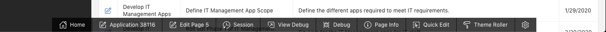
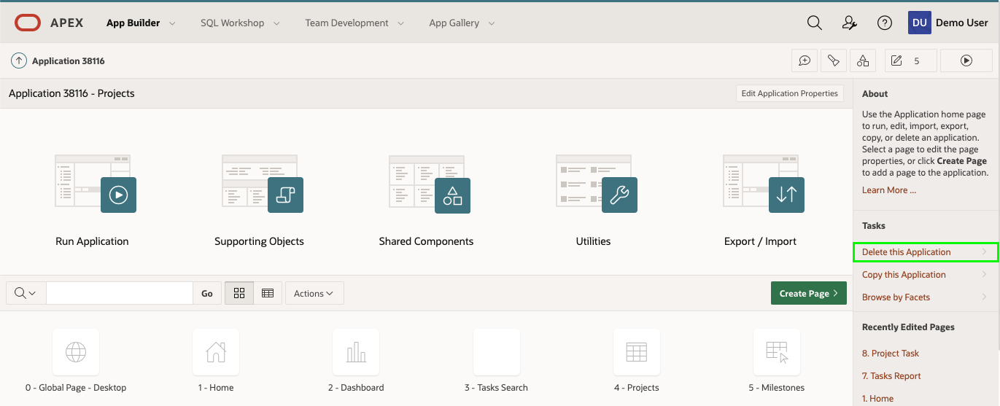
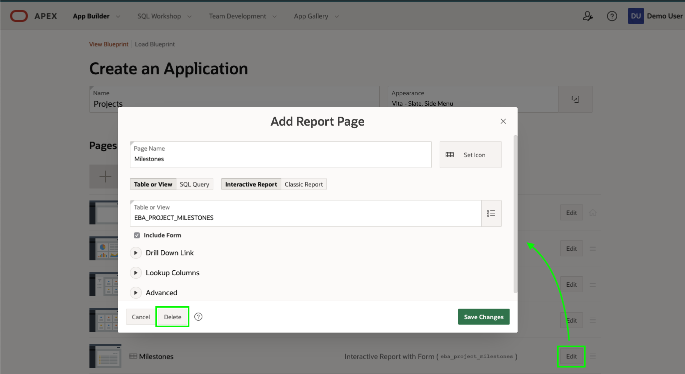
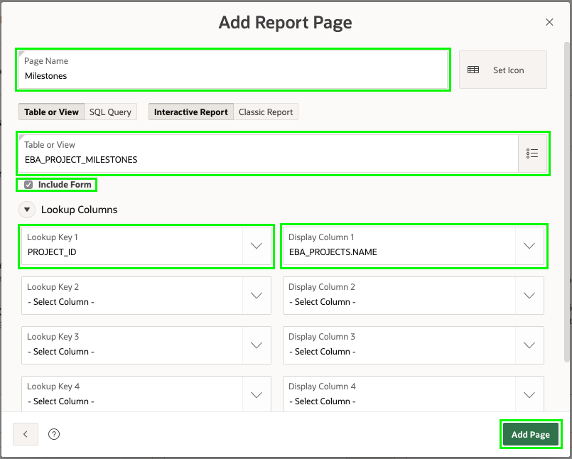
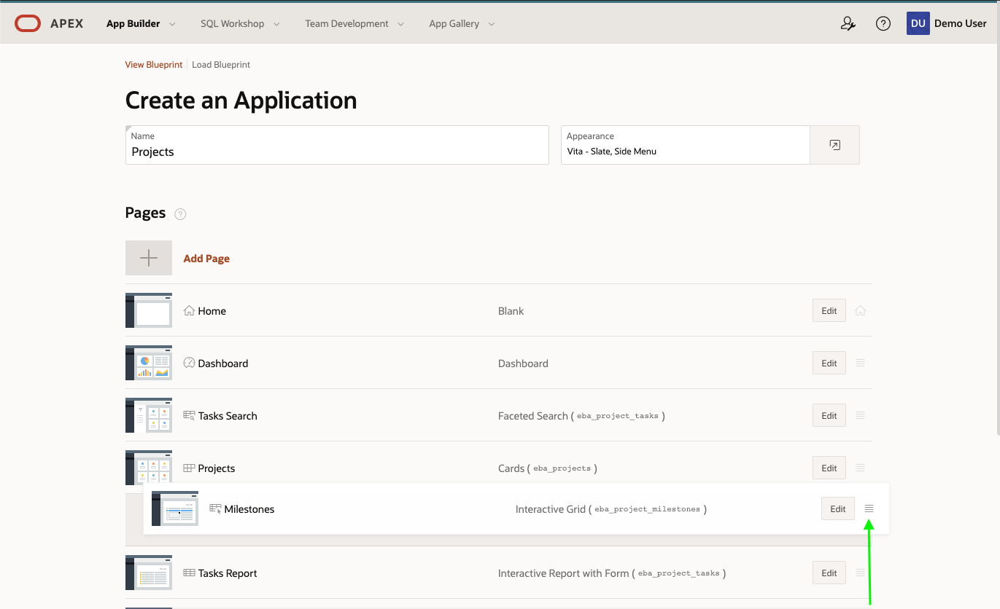
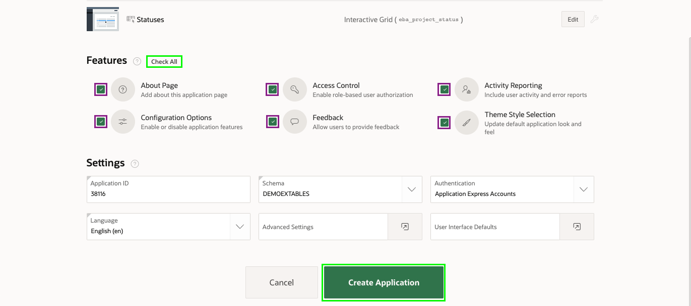

# 모듈 4 : 애플리케이션 재생성

런타임 환경에서 마일스톤으로 이동한 다음 보고서 페이지에서 edit 아이콘을 클릭하면 마일스톤 유지보수용 양식 페이지가 표시된다. 여기에는 필드가 몇 개밖에 없다는 것을 알게 될 것입니다. 따라서, 여러개의 레코드를 그리드 내에서 직접 관리할 수 있는 스프레드시트와 유사한 Interactive Grid를 활용하는 것이 좋을 수도 있습니다.

## **파트 1** - 생성한 애플리케이션 삭제

Create Application 마법사에서 애플리케이션을 생성하려면 방금 생성한 애플리케이션을 삭제하는 것이 혼동을 방지하기 위해 가장 좋은 방법입니다.

1. 런타임 환경의 개발도구 툴바에서 **애플리케이션 xxxxx** 를 클릭하세요.

   

   *( 참고 : 개발자 도구 툴바는 App Builder에서 애플리케이션을 실행하는 개발자에게만 표시됩니다. end-user들 에게 개발자 도구 툴바는 표시되지 않습니다. )*

2. 애플리케이션 홈페이지에서 Tasks 아래에 있는 **Delete this Application** 를 클릭하세요.

   

3. Confirm Delete 페이지에서 **Permanently Delete Now** 를 클릭하세요.

## **파트 2** - 프로젝트 애플리케이션 리로드

The Create Application Wizard includes the ability to reload apps that you previously generated, making it easy to make some changes and then generate a new and improved version of the initial app.

1. App Builder 홈 페이지에서 **Create** 를 클릭하세요.

2. **New Application** 를 클릭

3. **Load Blueprint** 를 클릭

   Load Blueprint 에서 생성된 마지막 애플리케이션의 **``Load``** 버튼을 클릭하세요.

   

이전에 정의한 애플리케이션 정의가 표시됩니다.

## **파트 3** - 마일스톤 페이지 교체

마일스톤 레코드를 관리하는 두 가지 방법보다는 오리지널 리포트와 양식 페이지를 삭제한 다음 새 페이지를 추가하고 페이지 목록에 다시 배치한다.

1. 페이지 목록의 마일스톤 항목에서 **``Edit``** 버튼을 클릭.

2. **``Delete``** 버튼을 클릭.

   

3. Create Application 마법사에서 **Add Page** 를 클릭.

4. **Interactive Grid** 를 클릭.

5. Add Interactive Grid 페이지에서 아래와 같이 입력하세요.

   - Page Name - **Milestones** 입력
   - Table - **SAMPLE$PROJECT_MILESTONES** 선택
   - **Add Page** 클릭

   

6. 이제 새 페이지의 순서를 재정렬 하세요.

   페이지 목록의 마일스톤 페이지에서 햄버거 메뉴를 선택하세요.

   Projects 페이지 아래에 위치하도록 페이지를 끌어다 놓으세요.

   

## **파트 4** - 상태페이지 추가

**SAMPLE$PROJECT_STATUS** 테이블은 프로젝트 상태를 관리하기 위해 사용됩니다. 이 테이블은 유지관리가 가능해야 하지만 애플리케이션 관리자만 레코드를 수정할 수 있어야 합니다. 따라서 관리자 아래에 페이지를 추가하는 것이 최적의 솔루션 입니다.

1. Create Application 마법사에서 **Add Page** 클릭.

2. **Interactive Grid** 클릭.

3. Add Interactive Grid 페이지에서 아래와 같이 입력하세요.

   - Page Name - **Statuses** 입력
   - Table - **SAMPLE$PROJECT_STATUS** 선택
   - **Advanced** 확장
     - **Set as Administration Page** 클릭
   - **Add Page** 클릭

   

## **파트 5** - 애플리케이션 완료

Create Application 마법사 또한 접근제어, 활동보고, 피드백 등 다양한 기능을 애플리케이션에 추가하여 보다 기능적인 완성과 "production-ready" 할 수 있는 기능을 가지고 있습니다.

1. Create Application 마법사에서 Features 에 대하여 **Check All** 을 클릭해주세요.

2. **``Create Application``** 버튼을 클릭하세요.

   

   *( 참고 : 일반적으로 새 애플리케이션에는 새 애플리케이션ID가 생성됩니다. )*

   새 애플리케이션이 Application Builder 에 표시됩니다.

3. **Run Application** 클릭.

4. 유저 정보 입력.

5. **Milestones** 로 이동.

6. 그리드의 데이터를 직접 입력할 수 있는 방법을 보려면 컬럼을 더블클릭 하세요.

   

   *( 참고 : Project 컬럼에는 Project 목록이 표시되고, Name 과 Description 은 text area로 되어 있으며, Due Date 컬럼은 date-picker가 표시됩니다. )*

7. **Administration** 로 이동 후 기능들을 확인하세요.

   

## 요약

모듈 4를 완료했습니다. 이제 여러분은 애플리케이션을 재생성 하고 부가 기능들을 추가하는 방법을 알게 되었습니다. [모듈 5로 이동](Module5.md)하세요.