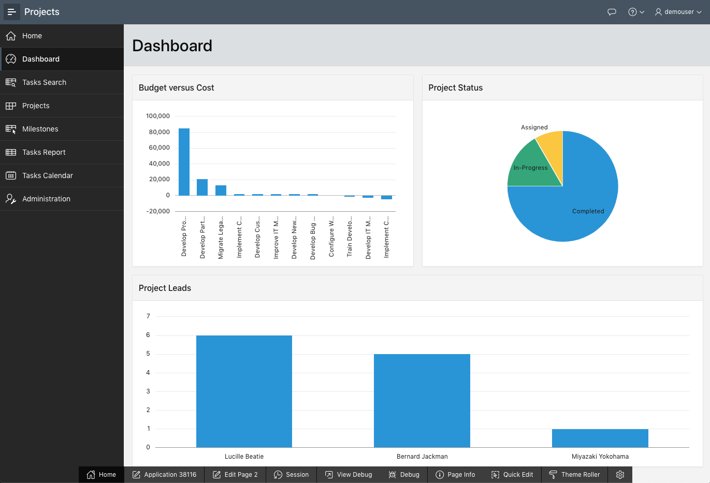
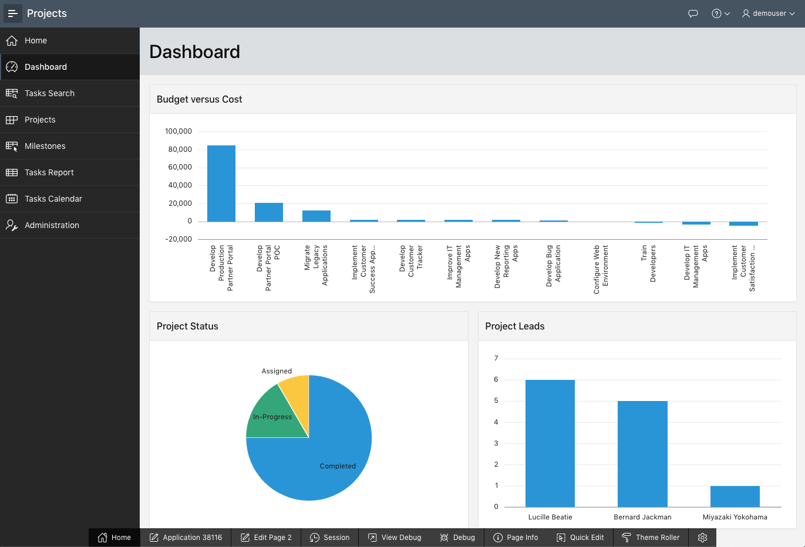

# 모듈 5 : 대시보드 개선

이 모듈에서는 영역들을 조작하는 방법을 배우게 됩니다.

## **파트 1** - 차트 4 삭제

대시보드를 보면 데모를 기반으로 한 차트 4가 삭제되어야함을 알 수 있습니다.

1. 런타임 환경에서 **Dashboard** 를 클릭.

2. 개발자 도구 툴바에서 (런타임 환경의 하단에 위치) **Edit Page 2** 를 클릭하세요.

   

   You should now be in Page Designer. Page Designer is where you will spend the majority of your time improving your application. There are three panes within Page Designer. The left pane initially displays the Rendering tree, with a list of page components. The middle pane displays the Layout, a representation of the page, and Gallery, from which you can drag and drop new components into the Layout. The right pane is the Property Editor, where you can change attributes for the selected component.

3. Within Page Designer, in the Rendering tree (left pane), *right-click* **Chart 4** and select **Delete**.

   

4. Let’s review the dashboard again.
   In the Page Designer toolbar, click **Save and Run**.

   

   The revised layout will be displayed.

   

## **파트 2** - Move Regions

Looking at the revised Dashboard page, it would look better to have the Budget versus Cost chart on a line by itself.

1. From the runtime environment, navigate back to the App Builder by clicking **Edit Page 2** in the Developer Toolbar, or by navigating back to the App Builder browser tab manually.

2. Within Page Designer, in the Rendering tree (left pane), click **Project Status**.
   In the Property Editor (right pane), ***check\*** Layout > Start New Row.
   *{Note: Within Layout (middle pane) the region will move onto a row by itself}*

   

3. Now to move the Project Leads chart up on to the same line as the Project Status chart.
   In the Rendering tree (left pane), click **Project Leads**.
   In the Property Editor (right pane), ***uncheck\*** Layout > Start New Row.
   *{Note: Within Layout (middle pane) the region will move up to be on the same row as Project Status}*

   

4. Now to review the page!
   Click **Save and Run**.

   

## **요약**

모듈 5를 완료했습니다. 이제 여러분은 애플리케이션을 삭제하고 위치를 변경하는 방법을 알게 되었습니다.

[모듈 6으로 이동](Module6.md)하세요.